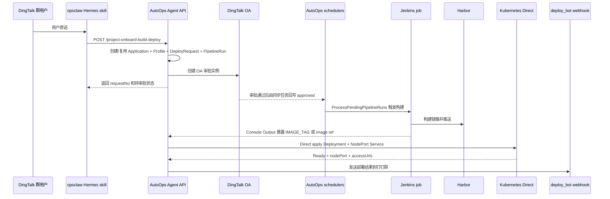

# java-demo-dingtalk-minimal-e2e design

## 0. 术语约定

| 术语 | 定义 | 防冲突结论 |
| --- | --- | --- |
| 最小 E2E | 只验证用户原话触发的最窄真实流程：DingTalk → Hermes → AutoOps → OA → Jenkins → Harbor → Direct Kubernetes → deploy_bot 回群。 | 不等同于完整部署平台改造；只允许处理阻塞该流程的小修。 |
| 用户原话 | `帮我把 git@gayhub.seeingtv.com:ipaas/java-demo.git 的 main 分支重新部署到测试环境，需要能对外访问`。 | 作为唯一入口样例；其他语言、其他 repo、生产环境不在本 feature 中扩展。 |
| Agent 自动接入请求 | Hermes 调 `POST /api/v1/integrations/agent/project-onboard-build-deploy`，由 AutoOps 自动创建 / 复用 Application 与 Profile。 | 不能退化为 Hermes 追问 image / namespace / Jenkins job 后走 `deploy-requests`。 |
| Direct NodePort | AutoOps 使用 Direct 模式创建 Kubernetes `Deployment` 和 `Service(type=NodePort)`，访问地址来自节点 IP + NodePort。 | 不等同于 Gateway / Ingress / MetalLB 独立暴露；固定 VIP 展示留给后续 `nodeport-access-feedback`。 |
| 战术修正 | E2E 前后发现的、只影响本次最小流程的小范围修正，例如 Hermes `chatContext` 字段名、Jenkinsfile 输出 `IMAGE_TAG`，或实施中暴露的 Harbor Gateway 超时、Direct deployer RBAC 这类运行配置阻断。 | 不做结构重构；只做最小运行配置修复并记录证据；发现需要大改时记录 blocker，转后续 roadmap item。 |
| 证据包 | feature 目录下记录的脱敏证据：requestNo、审批状态、Jenkins build、Harbor artifact、Kubernetes 资源、访问 URL、回群通知状态。 | 只记录资源名、状态、时间、脱敏 URL；不得记录真实 token、密码、PAT、webhook、kubeconfig。 |

## 1. 决策与约束

### 需求摘要

本 feature 的目标是用用户原话在钉钉群里触发 opsclaw Hermes agent，让 Hermes 通过 AutoOps Agent API 发起 `java-demo` 测试环境重新部署。成功标准是：群里收到申请已提交反馈；审批通过后 Jenkins 构建成功并推送 Harbor；AutoOps Direct 在测试环境创建 / 更新 `Deployment` 和 `NodePort Service`；最终 deploy_bot 在群里返回部署结果、镜像和访问地址。

本 feature 服务于真实流程验证，不新增通用平台能力。若 E2E 中暴露的问题属于已拆出的后续子 feature，例如 `AUTOOPS_IMAGE` 解析、固定 `nodeport_access_host`、Hermes skill 版本化副本，则只做不破坏现状的最小修正或记录 blocker，不在本 feature 中扩成完整方案。

### 复杂度档位

按「生产外部集成验证」处理，偏离项目内部工具默认档位：

- 健壮性 = L3（偏离默认 L2 的原因：入口来自钉钉用户和远端 Hermes，失败必须有明确状态和错误信息，不能静默吞掉）。
- 可观测性 = traced（偏离默认 logged 的原因：验收依赖跨 DingTalk、Hermes、AutoOps、Jenkins、Harbor、Kubernetes 的可串联证据）。
- 安全性 = validated（偏离默认 trusted 的原因：Git URL、env、gitRef、exposureMode 都来自外部消息；证据记录必须脱敏）。
- 幂等性 = idempotent（特殊维度：重复说「重新部署」应复用同一 Application / Profile，并创建新部署申请；不得创建冲突应用或错误 namespace）。

### 关键决策

1. **从 roadmap 最小条目直接起头**
   第一目标是验证真实流程是否已能跑通，而不是先完善通用 Jenkinsfile 契约或 NodePort 固定地址。若现有 Jenkinsfile 已输出 `IMAGE_TAG` 或 `docker push ...`，本 feature 不等待 `AUTOOPS_IMAGE` 解析落地。

2. **真实触发必须从钉钉群进入**
   可以先做只读 preflight 和必要的脱敏 dry-run，但最终验收必须使用用户原话在钉钉群触发。裸 `curl` 只能作为定位手段，不算最终验收。

3. **Hermes 只调 AutoOps，不直接操作下游系统**
   即使 opsclaw 可 SSH，Hermes 也只能用于读取自身 skill / 环境和调用 AutoOps API。Jenkins、Harbor、Kubernetes 的状态由 AutoOps 或人工只读检查确认，不让 Hermes 直接部署。

4. **只允许战术修正，不做结构重构**
   允许修正：Hermes 脚本字段名、缺失的运行时环境变量、Jenkinsfile 输出当前 AutoOps 可解析的 `IMAGE_TAG`，以及真实 E2E 阻断暴露出的 Harbor HTTPRoute timeout、AutoOps deployerAccess RBAC 这类最小运行配置。禁止修正：重构 `pipeline.go`、重写 Direct executor、引入新的 Gateway / Ingress 暴露模式、改审批模型。

5. **证据优先于推断**
   每个阶段以可观察状态为准：AutoOps request / pipeline 状态、DingTalk OA 实例、Jenkins build、Harbor artifact、Kubernetes `Deployment` / `Service`、deploy notification。不能只凭「接口返回成功」判定 E2E 完成。

### 明确不做

- 不支持生产环境、`prod`、正式发布或复杂审批矩阵。
- 不新增 Gateway / Ingress / MetalLB 独立暴露模式。
- 不让 Hermes 追问或提交容器镜像、namespace、clusterTarget、Jenkins job、Harbor project / repository。
- 不写 `pukka-gitops` release 文件，不依赖 ArgoCD 托管本次业务应用部署。
- 不把真实 token、密码、PAT、webhook、kubeconfig、钉钉 Secret 写入任何 `.codestable` 文档。
- 不把 `repo-jenkinsfile-build-contract`、`nodeport-access-feedback` 的完整能力并入本 feature。

## 2. 名词与编排

### 2.1 名词层

#### 现状

- Agent 路由已经存在：`api/router/deploy/deploy.go` 注册 `/integrations/agent/project-onboard-build-deploy`、`/build-deploy-requests` 和状态查询接口。
- Git URL 自动接入 DTO 已存在：`api/api/deploy/model/deploy.go` 的 `CreateAgentProjectOnboardBuildDeployRequest` 包含 `gitRepoUrl`、`env`、`gitRef`、`exposureMode`、`buildParams`、`chatContext`。
- 自动接入服务已存在：`api/api/deploy/service/agentBuildDeploy.go` 的 `CreateAgentProjectOnboardBuildDeployRequest` 会解析 Git URL、校验 host allowlist、派生 `applicationCode`，再调用 Profile 驱动的 build-deploy。
- Direct 部署名词已存在：`DeployRequest` 保存 `mode`、`workflowKind`、`serviceType`、`servicePort`、`targetPort`、`chatContextJson`；`AccessInfo` 已包含 `nodePort`、`nodePorts`、`accessUrls`。
- Jenkins 构建结果解析已存在：`api/api/deploy/service/jenkinsPipeline.go` 当前识别 `IMAGE_TAG`、`image tag`、`docker/podman push`、`pushed image` 等旧格式。
- 钉钉回群结构已存在：`api/api/deploy/service/notifier.go` 的 `ChatContext` 使用 `chat_id`、`at_user_ids`、`at_mobiles`。
- opsclaw 运行环境已存在：`~/.hermes/skills/devops/deploy-via-autoops/SKILL.md` 能识别 Git URL + `nodeport`；`~/.hermes/scripts/autoops-deploy.sh` 当前会调用 AutoOps，但请求体里仍使用 `chatId` / `atUserIds`。

#### 变化

- 固定本次 E2E 的 Agent 请求样例，不新增 AutoOps API 字段：

```json
{
  "requesterExternalType": "dingtalk",
  "requesterExternalId": "<dingtalk-user-id>",
  "requesterDisplayName": "<display-name>",
  "gitRepoUrl": "git@gayhub.seeingtv.com:ipaas/java-demo.git",
  "env": "test",
  "gitRef": "main",
  "exposureMode": "nodeport",
  "reason": "帮我把 git@gayhub.seeingtv.com:ipaas/java-demo.git 的 main 分支重新部署到测试环境，需要能对外访问",
  "chatContext": {
    "provider": "dingtalk",
    "chat_id": "<dingtalk-chat-id>",
    "at_user_ids": ["<dingtalk-user-id>"],
    "sender_external_id": "<dingtalk-user-id>",
    "extra": {
      "intent": "redeploy",
      "externalAccessRequired": true
    }
  }
}
```

来源：roadmap `dingtalk-autoops-deploy-e2e` 第 4.2 节；AutoOps DTO 来源为 `api/api/deploy/model/deploy.go`。

- 本 feature 只把 opsclaw Hermes 请求体修到当前契约可用；不扩展 AutoOps `ChatContext` schema。
- 本 feature 的证据包作为 feature-local 文档新增，建议路径：`.codestable/features/2026-05-12-java-demo-dingtalk-minimal-e2e/java-demo-dingtalk-minimal-e2e-evidence.md`。
- 若 Jenkinsfile 当前无法被 AutoOps 解析，优先让 Jenkinsfile 输出旧格式 `IMAGE_TAG=<tag>` 或 `docker push <image:tag>`；`AUTOOPS_IMAGE` 优先解析留给 `repo-jenkinsfile-build-contract`。

### 2.2 编排层



#### 现状

- 创建阶段是线性编排：`CreateAgentProjectOnboardBuildDeployRequest` → `ensureAgentProjectOnboarded` → `CreateAgentBuildDeployRequest` → `CreateAgentDeployRequest`。
- 审批阶段由 `tryDispatchApproval` 发起 OA；`DeployApprovalSyncScheduler` 轮询审批状态，build-deploy 审批通过后交给流水线调度器。
- 流水线阶段由 `PipelineScheduler` 调 `ProcessPendingPipelineRuns`，`PipelineService.StartPipelineRun` 按 build → scan → deploy → notify 执行。
- Direct deploy 阶段由 `directExecutor.go` 创建 namespace、应用 manifest、等待 ready，并收集 `AccessURLs`。
- 通知阶段由 `DeployNotifier.NotifyExecutionResult` 读取 `ChatContextJSON` 和 `integrations.deploy_bot` 发送 Markdown。

#### 变化

- 在进入真实钉钉触发前增加 preflight 编排：只读检查 opsclaw Hermes skill、AutoOps URL、Agent Token 是否配置、AutoOps 健康状态、项目自动接入配置、OA / deploy_bot key 是否存在、Jenkins / Harbor / ClusterTarget ID 是否可用。
- 对已知最小阻塞做战术修正：若 opsclaw 脚本仍输出 `chatId` / `atUserIds`，改为 `chat_id` / `at_user_ids`；若 Jenkinsfile 没有当前解析器可识别的输出，补 `IMAGE_TAG=<tag>`；若 Jenkins→Harbor 或 Direct deployer 权限阻断真实 E2E，只做最小运行配置修复并记录证据。
- 真实触发后只按状态推进，不绕过审批：创建请求成功后等待 OA 审批，通过后等待 Pipeline 自动执行。
- E2E 证据包在每个阶段追加脱敏记录，失败时记录停止阶段、错误信息和建议转入的 roadmap item。

#### 流程级约束

- **错误语义**：业务错误以 JSON `code != 200` 为准；认证错误读取 `msg`；pipeline 失败时以 `pipelineStatus=failed`、`errorMessage`、stage detail 为准。
- **幂等性**：重复请求应复用 `Application(code=java-demo)` 和 `test` Profile，但每次创建新的 `DeployRequest` / `PipelineRun`；不得创建 `java-demo-1` 之类平行应用。
- **顺序约束**：不得在 `approvalStatus=approved` 前触发部署；不得在 Jenkins build 成功并解析镜像前创建 Kubernetes workload。
- **扩展点位置**：`AUTOOPS_IMAGE` 优先解析、固定 NodePort host、Hermes skill 版本化副本属于后续子 feature；本 feature 只记录 blocker 或做兼容旧契约的小修。
- **可观测点**：每一段必须至少记录一个证据：请求号、审批实例状态、Jenkins build number / URL、Harbor artifact、Kubernetes `Deployment` / `Service`、状态接口 `accessInfo`、deploy notification 状态。
- **安全约束**：证据包和日志摘录必须脱敏；禁止复制 Secret 值、完整 webhook、PAT、kubeconfig。

### 2.3 挂载点清单

本 feature 不新增 AutoOps 运行时挂载点；它使用现有挂载点完成 E2E。可卸载性按「移除本 feature 的战术修正和证据文件后，系统回到原有能力」判断。

- opsclaw Hermes skill / 脚本：`~/.hermes/skills/devops/deploy-via-autoops/SKILL.md`、`~/.hermes/scripts/autoops-deploy.sh` — 仅在 preflight 发现字段不符时修改 `chatContext` 输出为 snake_case。
- java-demo repo Jenkinsfile：`git@gayhub.seeingtv.com:ipaas/java-demo.git` 的 `Jenkinsfile` — 仅在 Jenkins Console Output 缺少 AutoOps 当前可解析镜像结果时补 `IMAGE_TAG=<tag>` 或等价旧格式输出。
- pukka-gitops 运行配置：`platform/harbor/harbor-httproute.yaml`、`charts/autoops/values.yaml`、`charts/autoops/templates/deployer-access-rbac.yaml`、`apps/autoops/values.yaml` — 仅在真实 E2E 暴露 Harbor 上传超时或 Direct deployer RBAC 阻断时做最小配置修复；不写 `apps/autoops-managed-releases/releases/` 业务 release 文件。
- feature-local 证据文件：`.codestable/features/2026-05-12-java-demo-dingtalk-minimal-e2e/java-demo-dingtalk-minimal-e2e-evidence.md` — 新增脱敏证据包。

已存在但本 feature 不新增的系统挂载点：AutoOps Agent 路由、OA 同步调度器、Pipeline 调度器、Direct executor、deploy_bot webhook。

### 2.4 推进策略

1. **Preflight 骨架**：只读检查 Hermes、AutoOps、pukka-gitops、Kubespray、Jenkins、Harbor、ClusterTarget 和 Secret key 存在性。
   退出信号：得到一份不含 Secret 值的「可触发 / 阻塞」判断，阻塞项归类到本 feature 战术修正或后续 roadmap item。

2. **战术修正节点**：只处理最小 E2E 必需的小修，例如 Hermes `chatContext` snake_case、Jenkinsfile 输出 `IMAGE_TAG`、Harbor HTTPRoute timeout、AutoOps deployerAccess RBAC。
   退出信号：修正后能构造符合 roadmap 第 4.2 节的 Agent 请求；Jenkins Console Output 至少有一种当前 AutoOps 可解析镜像结果。

3. **真实入口触发**：在钉钉群发送用户原话，由 Hermes 调 AutoOps。
   退出信号：群内或 Hermes 响应出现 `requestNo`，AutoOps 返回 `workflowKind=build_deploy`、`mode=direct`、`approvalStatus=pending`。

4. **审批与流水线推进**：审批人通过 OA，等待审批同步和 PipelineScheduler 自动执行。
   退出信号：状态查询显示 `approvalStatus=approved`，`pipelineStatus` 依次进入 `building` / `deploying` / `succeeded`，或失败时有明确 stage error。

5. **Kubernetes 与访问验证**：确认测试 namespace 中 `Deployment` ready、`Service(type=NodePort)` 存在，并对访问 URL 发起验证。
   退出信号：`curl http://<node-ip>:<nodePort>/` 或等价访问方式返回应用可识别响应；状态接口 `accessInfo` 包含镜像、namespace、NodePort / accessUrls。

6. **回群与证据收尾**：确认 deploy_bot 通知发送成功，并写入 feature-local 证据包。
   退出信号：钉钉群可见部署结果，证据包包含 requestNo、审批、Jenkins、Harbor、Kubernetes、访问 URL 和通知记录。

### 2.5 结构健康度与微重构

##### 评估

- compound convention：已用 `search-yaml.py` 搜索「deploy dingtalk hermes jenkins harbor nodeport directory organization convention」，未命中可复用的目录组织或命名 convention。
- 文件级 — `api/api/deploy/service/deploy.go`：约 1966 行，职责包含申请创建、审批、执行、状态、访问结果；本 feature 不计划修改该文件。
- 文件级 — `api/api/deploy/service/pipeline.go`：约 882 行，职责包含 PipelineRun 编排和 stage 状态；本 feature 不计划在这里新增 `AUTOOPS_IMAGE` 解析。
- 文件级 — `api/api/deploy/service/agentBuildDeploy.go`：约 687 行，负责 Agent build-deploy 和自动接入；本 feature 只使用现有能力，不计划修改。
- 文件级 — `api/api/deploy/service/directExecutor.go`：约 528 行，负责 Direct apply 和访问地址收集；本 feature 只验证现有输出。
- 文件级 — opsclaw `~/.hermes/scripts/autoops-deploy.sh`：外部脚本约 160 行，职责集中，若修改只涉及 `chatContext` key 名，不需要拆分。
- 目录级 — `.codestable/features/`：当前只有一个 feature draft 目录，本次新增一个 feature 目录不会造成摊平问题。
- 目录级 — `docs/`：本 feature 不计划新增 `docs/` 文档；证据落在 feature 目录。

##### 结论：不做微重构

本 feature 是真实 E2E 验证与小范围修正，不适合在部署控制面的大文件中做「只搬不改行为」的微重构。即使 `deploy.go` / `pipeline.go` 明显偏胖，重构会增加 E2E 变量，违背「先证明真实流程」的目标。

##### 超出范围的观察

- `api/api/deploy/service/deploy.go`、`pipeline.go`、`agentBuildDeploy.go` 已经偏胖，后续如继续扩展 Agent / Pipeline 能力，建议另走 `cs-refactor` 做服务拆分。
- AutoOps 仓库内缺少文档声称的 `skills/devops/deploy-via-autoops/SKILL.md` 副本，属于 skill 版本化治理问题；本 feature 可在证据中记录，完整修复应放入 `hermes-deploy-skill-routing`。
- `nodeport_access_host` 已由 Helm 渲染但未被 Go config 消费，属于配置契约缺口；本 feature 不修，后续由 `nodeport-access-feedback` 处理。

## 3. 验收契约

### 关键场景清单

1. **Preflight 正常**：读取 opsclaw Hermes skill、AutoOps Helm values、Kubespray inventory 和 AutoOps 状态 → 证据包记录「可触发」或列出明确 blocker，且不包含任何 Secret 值。
2. **意图解析正常**：在钉钉群发送用户原话 → Hermes 调用 `project-onboard-build-deploy`，请求中 `gitRepoUrl`、`env=test`、`gitRef=main`、`exposureMode=nodeport`、snake_case `chatContext` 正确。
3. **创建申请正常**：AutoOps 返回成功 → 响应包含 `requestNo`、`mode=direct`、`workflowKind=build_deploy`、`approvalStatus=pending`、`namespace=ao-direct-java-demo-test` 或符合当前 `namespace_prefix` 的等价命名。
4. **审批正常**：审批人通过 DingTalk OA → 状态查询显示 `approvalStatus=approved`，build-deploy 不绕过审批直接执行。
5. **Jenkins 正常**：PipelineScheduler 触发 Jenkins → Jenkins build 成功，Console Output 包含 AutoOps 当前可解析的镜像 tag 或 image ref。
6. **Harbor 正常**：Jenkins 推送后 → Harbor 中出现与本次 build 对应的 `java-demo` artifact，AutoOps `finalImageRef` 指向该镜像。
7. **Direct 部署正常**：AutoOps deploy stage 执行后 → Kubernetes 测试 namespace 中 `Deployment/java-demo` ready，`Service/java-demo` 为 `NodePort`。
8. **对外访问正常**：使用状态接口或 `kubectl get svc` 得到 NodePort → 访问 `http://<node-ip>:<nodePort>/` 返回 java-demo 可识别响应。
9. **回群正常**：deploy_bot webhook 发送成功 → 钉钉群消息包含申请号、状态、镜像、namespace、Service 类型、NodePort 或访问地址。
10. **错误路径可定位**：任一阶段失败 → 证据包记录失败阶段、AutoOps `errorMessage` / pipeline stage error / Jenkins build URL / Kubernetes event 摘要，并指向后续应处理的 roadmap item。

### 明确不做的反向核对项

- E2E 过程中不应出现 Hermes 直接执行 `kubectl apply`、直接调用 Jenkins build API、直接推 Harbor 或写 `pukka-gitops` release 文件。
- Agent 请求 JSON 不应包含 `image`、`namespace`、`clusterTargetId`、`jenkinsJobName`、`harborProject` 这类应由 AutoOps Profile 补齐的字段。
- 证据包不应包含 `glpat-`、明文密码、完整 webhook URL、Bearer token、kubeconfig 内容或 Secret value。
- 本 feature 不应修改 AutoOps Go 控制面的架构性文件来实现 Gateway / Ingress / `nodeport_access_host`。
- 本 feature 不应把 `repo-jenkinsfile-build-contract` 的 `AUTOOPS_IMAGE` 优先解析作为完成前置；若必须依赖该能力才能跑通，应记录为 blocker 并转对应 roadmap item。

## 4. 与项目级架构文档的关系

本 feature 主要验证已存在的 Deploy 控制面，不引入新的系统级实体或 API。acceptance 阶段需要把以下事实回写或提示给架构现状文档：

- Hermes → AutoOps Agent API 的 Git URL 自动接入真实路径是否可用。
- build-deploy 审批通过后由 `DeployApprovalSyncScheduler` 与 `PipelineScheduler` 串联执行的真实状态流。
- Direct NodePort 访问地址的实际来源：节点 IP + NodePort，而不是 Helm values 中尚未被 Go 消费的 `nodeport_access_host`。
- deploy_bot 回群依赖 `ChatContext` snake_case 字段和 `integrations.deploy_bot` runtime Secret。

`.codestable/architecture/ARCHITECTURE.md` 当前仍是骨架，acceptance 时建议补一份 Deploy / Hermes 集成现状 doc，或至少在观察项中提示后续走 `cs-arch backfill`。
