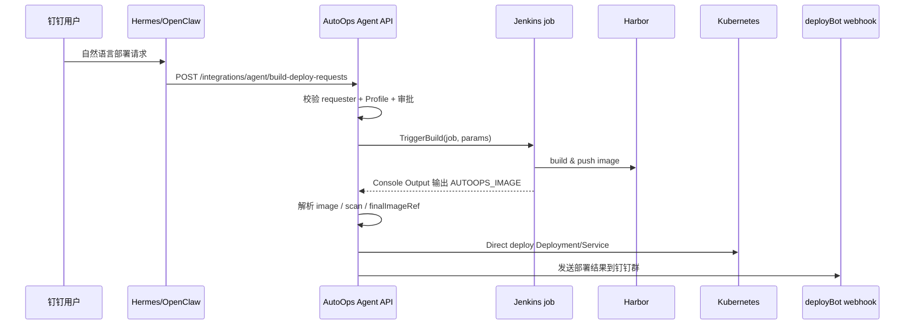

# repo-jenkinsfile-build-contract design

## 0. 术语约定

| 术语 | 定义 | 防冲突结论 |
| --- | --- | --- |
| Repo Jenkinsfile | 应用仓库内维护的 `Jenkinsfile`，负责源码构建、镜像构建、推送 Harbor，并按 AutoOps 契约输出镜像结果。 | 代码库和历史文档已有 `Jenkinsfile` 说法；本 feature 不引入「AutoOps 生成 Jenkinsfile」。 |
| AutoOps Agent 请求 | Hermes / OpenClaw 调用 AutoOps Agent API 的结构化 JSON 请求。 | 现有接口是 `/api/v1/integrations/agent/build-deploy-requests` 和 `/project-onboard-build-deploy`，不新增机器人直连 Jenkins 入口。 |
| Build Result Contract | Jenkinsfile 在 Console Output 中输出的稳定结果协议，优先包含 `AUTOOPS_IMAGE` 和 `AUTOOPS_IMAGE_TAG`。 | 现有解析器只识别 `IMAGE_TAG`、`image tag`、`docker/podman push` 等日志；新增 `AUTOOPS_*` 不与旧格式冲突。 |
| Profile | AutoOps 中「应用 + 环境」的权威部署配置，包含 Jenkins、Harbor、namespace、审批人、端口等信息。 | 现有 `AppDeployProfile` 已覆盖本 feature 需要的大部分字段，不新增平行配置中心。 |

## 1. 决策与约束

### 需求摘要

面向钉钉机器人触发的 dev/test 构建部署，固定如下职责边界：

```text
钉钉用户 prompt
→ Hermes / OpenClaw 理解意图
→ Hermes 调 AutoOps Agent API（结构化参数）
→ AutoOps 读取 Profile 并调 Jenkins job
→ Jenkins job 使用 repo 内 Jenkinsfile 构建并推送 Harbor
→ Jenkinsfile 输出 AutoOps build result contract
→ AutoOps 解析镜像，继续扫描、Direct deploy、结果通知
```

成功标准：Hermes 不保存 Jenkins / Harbor / Kubernetes 编排状态；AutoOps 能从 Jenkinsfile 输出中稳定得到最终镜像地址，并用现有 pipeline 继续部署和回群通知。

### 复杂度档位

走「项目内部工具」默认档位。偏离项：

- 可观测性 = traced（偏离默认 logged）：Jenkins 输出契约解析失败会直接阻断部署，失败信息必须能在 pipeline stage detail 和日志中定位到缺失字段。
- 稳定性 = stable（偏离默认 active）：该契约会被多个 repo Jenkinsfile 依赖，字段名必须向后兼容。

### 关键决策

1. **构建逻辑归 repo Jenkinsfile**
   AutoOps 不生成、不管理、不模板化各语言构建细节。Java / Node.js / Go / Python 差异由各仓库 Jenkinsfile 维护。

2. **AutoOps 是控制面，不是构建脚本平台**
   AutoOps 继续负责 Profile 解析、审批、pipeline 状态、Harbor scan、Direct deploy 和结果通知。

3. **Hermes 只做意图转结构化请求**
   Hermes 只提交 `applicationCode`、`env`、`gitRef`、`reason`、`buildParams`、`chatContext` 等字段，不直接调 Jenkins / Harbor / Kubernetes。

4. **优先解析显式 `AUTOOPS_*` 输出，兼容旧日志格式**
   Jenkinsfile 推荐输出 `AUTOOPS_IMAGE` 和 `AUTOOPS_IMAGE_TAG`；AutoOps 仍保留旧的 `IMAGE_TAG`、`docker push` 解析能力。

### 明确不做

- 不让 Hermes 直接调用 Jenkins、Harbor 或 Kubernetes。
- 不由 Jenkinsfile 执行 Kubernetes 部署、审批或 GitOps 写入。
- 不在本 feature 自动创建 GitLab repo、Harbor project 或 Jenkins job。
- 不做 AutoOps 自动生成 / 覆盖 repo Jenkinsfile。
- 不扩展生产环境、多集群审批矩阵或 StatefulSet 工作负载。
- 不新增数据库表；若确需记录契约版本，先放入 Profile 的 `BuildParamsJSON`。

## 2. 名词与编排

### 2.1 名词层

#### 现状

- `CreateAgentBuildDeployRequest` 位于 `api/api/deploy/model/deploy.go`，当前 Hermes 可提交 `applicationCode`、`env`、`gitRef`、`reason`、`buildParams`、`chatContext`。
- `AppDeployProfile` 位于 `api/api/app/model/deployProfile.go`，已保存 `JenkinsServerID`、`JenkinsJobName`、`HarborServerID`、`HarborProject`、`HarborRepository`、`DefaultGitRef`、`BuildParamsJSON` 等部署契约字段。
- `CreateAgentBuildDeployRequest` 在 `api/api/deploy/service/agentBuildDeploy.go` 中解析 Profile 并生成内部 `CreateAgentDeployRequest`，当前会向 Jenkins 参数补 `GIT_REF`、`ENV`、`RELEASE_NAME`、`HARBOR_CREDENTIALS_ID`。
- Jenkins 构建结果解析在 `api/api/deploy/service/jenkinsPipeline.go`，当前识别 `IMAGE_TAG`、`image tag`、`docker/podman push`、`pushed image` 等文本模式。

#### 变化

- 新增「Build Result Contract」作为跨 repo Jenkinsfile 共享协议，不新增数据库实体。
- AutoOps Jenkins 输出解析器新增优先级最高的显式字段：
  - `AUTOOPS_IMAGE=<registry>/<project>/<repository>:<tag>`
  - `AUTOOPS_IMAGE_TAG=<tag>`
  - 可选：`AUTOOPS_BUILD_LANGUAGE=<java|node|go|python|other>`
  - 可选：`AUTOOPS_BUILD_STRATEGY=<maven|jib|npm|dockerfile|go|python|other>`
- AutoOps 向 Jenkins 注入的标准参数固化为文档化契约；已有字段继续使用，不改变 API 形状。

#### 接口示例

Hermes 调 AutoOps：

```json
{
  "requesterExternalType": "dingtalk",
  "requesterExternalId": "ding-user-001",
  "requesterDisplayName": "张三",
  "applicationCode": "java-demo",
  "env": "dev",
  "gitRef": "main",
  "reason": "部署 java-demo dev 环境",
  "buildParams": {
    "BUILD_CONTRACT_VERSION": "v1"
  },
  "chatContext": {
    "provider": "dingtalk",
    "chat_id": "cidxxx",
    "at_user_ids": ["ding-user-001"]
  }
}
```

来源：`api/api/deploy/model/deploy.go` `CreateAgentBuildDeployRequest`。

AutoOps 触发 Jenkins 时的有效参数示例：

```json
{
  "GIT_REF": "main",
  "ENV": "dev",
  "RELEASE_NAME": "java-demo",
  "APPLICATION_CODE": "java-demo",
  "HARBOR_PROJECT": "java-demo",
  "HARBOR_REPOSITORY": "java-demo",
  "HARBOR_CREDENTIALS_ID": "harbor-robot",
  "BUILD_CONTRACT_VERSION": "v1"
}
```

来源：`api/api/deploy/service/agentBuildDeploy.go` `buildAgentDeployRequestFromProfile` 和 `requiredAgentProjectBuildParams`。

Jenkinsfile 输出示例：

```text
AUTOOPS_IMAGE=10.0.17.205:80/java-demo/java-demo:20260512-abcdef
AUTOOPS_IMAGE_TAG=20260512-abcdef
AUTOOPS_BUILD_LANGUAGE=java
AUTOOPS_BUILD_STRATEGY=maven-jib
```

主要错误路径：Jenkins 构建成功但没有 `AUTOOPS_IMAGE`，且旧格式也无法解析时，build stage 失败，错误信息仍是「未在 Jenkins 构建日志中提取到镜像标签」或更明确的同义错误。

### 2.2 编排层



#### 现状

- Agent 路由已存在：`api/router/deploy/deploy.go` 注册 `/integrations/agent/build-deploy-requests` 和 `/project-onboard-build-deploy`。
- `CreateAgentBuildDeployRequest` 当前线性编排：校验钉钉身份 → 查询 Application → 查询 Profile → 生成 Direct build-deploy 请求。
- `PipelineService.StartPipelineRun` 当前线性编排：build → scan → deploy → notify。
- `executeBuildStage` 触发 Jenkins、等待构建、解析镜像、写入 `artifact_tag` / `planned_image_ref`。
- `executeDeployStage` 根据 `finalImageRef` 更新 `DeployRequest.image`，再调用 Direct deploy。
- `DeployNotifier` 使用 `ChatContext` 和 `integrations.deploy_bot` webhook 发送结果。

#### 变化

- Hermes 编排不扩展：继续只调用 AutoOps Agent API。
- AutoOps build stage 插入「显式 AutoOps 输出解析」分支：先找 `AUTOOPS_IMAGE` / JSON 结果，再回退旧模式。
- Jenkinsfile 只需要遵守输出契约；构建语言、工具链和 Docker/Jib 细节不进入 AutoOps 编排。
- Profile 继续作为权威配置；repo Jenkinsfile 不允许覆盖 namespace、approver、clusterTarget、deploy mode。

#### 流程级约束

- 错误语义：Jenkins build 非 `SUCCESS` 或镜像结果缺失时，pipeline 停在 build stage，不进入 scan / deploy。
- 幂等性：同一个 `requestNo` 仍只关联一个 `PipelineRun`；本 feature 不新增 retry/reset 语义。
- 顺序约束：必须先解析出最终镜像，再执行 Harbor scan 和 Direct deploy。
- 扩展点：未来新增 `AUTOOPS_BUILD_RESULT_JSON` 时，只扩展解析器，不改变 Hermes API。
- 可观测点：stage detail 记录 `extractedImageRef`、`artifactTag`、`plannedImageRef`、Jenkins build URL；解析失败时记录缺失契约字段。

### 2.3 挂载点清单

- Jenkins 输出解析协议：`api/api/deploy/service/jenkinsPipeline.go` 的 image tag patterns / parser — 修改。
- Agent build-deploy 契约说明：`docs/` 下新增或更新 repo Jenkinsfile contract 文档 — 新增 / 修改。
- Profile build params 契约：`AppDeployProfile.BuildParamsJSON` 中约定 `BUILD_CONTRACT_VERSION` 等 key — 约定层修改，不新增 schema。
- Jenkinsfile starter 示例：`docs/` 或示例目录提供 Java repo Jenkinsfile 片段 — 新增。

### 2.4 推进策略

1. 编排契约：先固化 AutoOps ↔ Jenkinsfile 输入 / 输出契约。
   退出信号：文档中能回答 Hermes、AutoOps、Jenkinsfile 各自负责什么。
2. 解析节点：扩展 Jenkins 输出解析，优先识别 `AUTOOPS_IMAGE` / `AUTOOPS_IMAGE_TAG`。
   退出信号：单元测试覆盖显式字段、旧格式回退、缺失字段错误。
3. 参数节点：确认 AutoOps 注入 Jenkins 的标准参数集合，并通过 Profile `BuildParamsJSON` 保持兼容。
   退出信号：现有 build-deploy 请求能产生契约参数，不破坏自定义 build params。
4. 文档与示例：补 Java repo Jenkinsfile starter 和 Hermes 调用示例。
   退出信号：示例能被人工复制到 repo Jenkinsfile 并说明必须输出的字段。
5. E2E 验证：用 dev/test 示例应用跑一条 AutoOps 调 Jenkinsfile 的链路。
   退出信号：AutoOps pipeline 记录最终镜像，Direct deploy 成功，钉钉回群包含镜像和访问地址。

### 2.5 结构健康度与微重构

##### 评估

- 文件级 — `api/api/deploy/service/jenkinsPipeline.go`：约 546 行，职责集中在 Jenkins API 调用和 Console Output 解析；本 feature 只改解析协议，改动密度低。
- 文件级 — `api/api/deploy/service/pipeline.go`：约 882 行，职责偏胖，包含 pipeline 编排、stage 状态、Jenkins/Harbor/Deploy 串联；本 feature 仅依赖现有 `executeBuildStage` 结果字段，不应在这里扩大改动。
- 文件级 — `api/api/deploy/service/agentBuildDeploy.go`：约 687 行，职责包含 Agent 请求、项目接入、Profile 默认值；本 feature 不新增主流程，只确认现有参数契约。
- 目录级 — `api/api/deploy/service/`：服务文件较多，但本 feature 不需要新增 Go 文件。
- 目录级 — `docs/`：已有 deploy / DingTalk 相关文档，新增一份契约文档不会造成目录重组压力。

##### 结论：不做微重构

本 feature 的主体是契约固化和解析器增强，能通过小范围修改完成。`pipeline.go` 和 `agentBuildDeploy.go` 偏胖是事实，但拆分会涉及编排职责重划，超出「只搬不改行为」边界。

##### 超出范围的观察

- `api/api/deploy/service/pipeline.go`：pipeline stage 编排和各阶段计算逻辑混在一个文件，后续可走 `cs-refactor` 拆出 build / scan / deploy stage handler。本 feature 不动。
- `api/api/deploy/service/agentBuildDeploy.go`：自动接入默认值、仓库解析、Profile 同步集中在一个文件，后续可走 `cs-refactor` 分离 onboarding helper。本 feature 不动。

## 3. 验收契约

### 关键场景清单

1. 正常路径：Jenkins Console Output 包含 `AUTOOPS_IMAGE=10.0.17.205:80/java-demo/java-demo:tag` → AutoOps build stage 提取完整镜像，`plannedImageRef` 为该值，deploy stage 使用该镜像。
2. 兼容路径：Jenkins Console Output 只包含旧格式 `IMAGE_TAG=tag` → AutoOps 仍按 Harbor Profile 拼接最终镜像，不破坏存量 Jenkinsfile。
3. 回退路径：Jenkins Console Output 包含 `docker push 10.0.17.205:80/java-demo/java-demo:tag` → AutoOps 仍能提取完整镜像。
4. 错误路径：Jenkins build 成功但没有任何可解析镜像输出 → pipeline build stage 失败，不进入 scan / deploy，错误信息指向缺少镜像输出契约。
5. 权限边界：Hermes 请求只包含 `applicationCode/env/gitRef/reason/buildParams/chatContext` → AutoOps 从 Profile 补齐 Jenkins / Harbor / namespace / approver，不接受 Hermes 覆盖部署目标。
6. 通知路径：Direct deploy 成功后 → deployBot 发送的钉钉结果包含申请号、镜像、命名空间、Service / NodePort 访问地址。

### 明确不做的反向核对项

- 代码中不应出现 Hermes 直接调用 Jenkins / Harbor / Kubernetes 的新入口。
- Jenkinsfile 示例中不应出现 `kubectl apply`、GitOps 写文件或 OA 审批逻辑。
- AutoOps 不应新增生成或覆盖 repo Jenkinsfile 的代码。
- 本 feature 不应新增数据库表或强制迁移字段。
- 本 feature 不应新增生产环境、多集群或 StatefulSet 分支。

## 4. 与项目级架构文档的关系

acceptance 阶段应把以下稳定结论回写到 architecture / deploy 控制面文档：

- 职责边界：Hermes 负责 prompt → AutoOps Agent 请求；AutoOps 负责控制面；repo Jenkinsfile 负责构建镜像。
- Build Result Contract：`AUTOOPS_IMAGE` / `AUTOOPS_IMAGE_TAG` 是 Jenkinsfile 向 AutoOps 回传镜像结果的推荐协议。
- 主流程：Agent build-deploy 当前主线是 AutoOps 调 Jenkins 后走 Harbor scan 和 Direct deploy。
- 约束：Jenkinsfile 不执行部署；AutoOps 不生成 Jenkinsfile；GitOps 是兼容路径而非新项目默认路径。
